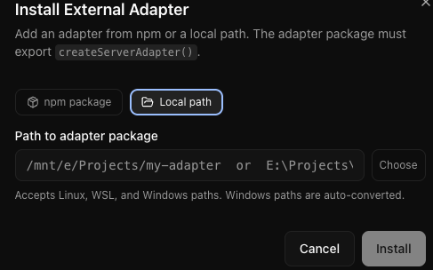
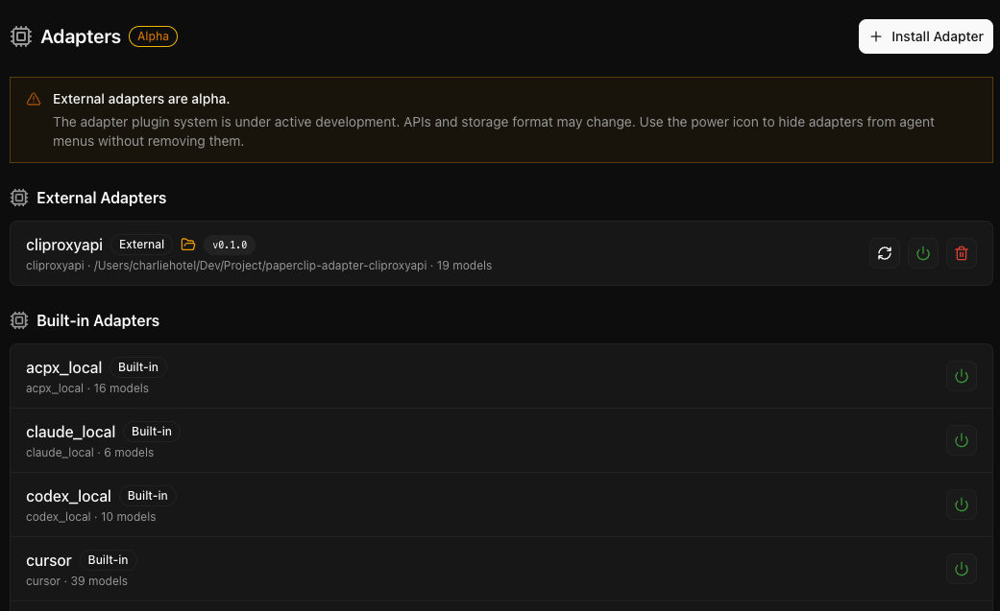
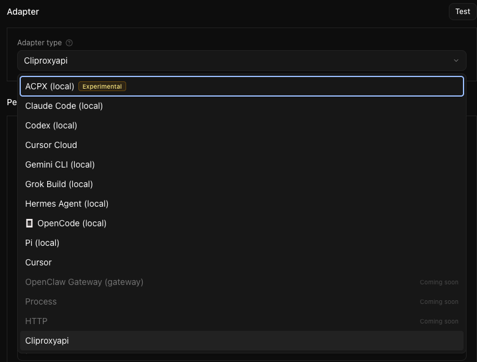
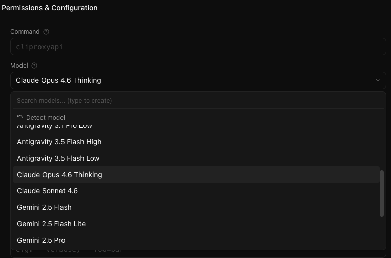

# paperclip-adapter-cliproxyapi

[🇰🇷 한국어 버전](./README.ko.md)

An external adapter plugin for [Paperclip](https://github.com/charliehotel/paperclip) that integrates agents with [CLIProxyAPI](https://github.com/charliehotel/cliproxyapi). It serves as a local, OpenAI-compatible proxy allowing you to run Paperclip agents using Google Gemini, Anthropic Claude, and Antigravity models.

## Features

- **Standard Compliance**: Fully implements Paperclip's `ServerAdapterModule` and interfaces.
- **Declarative Configuration**: Exposes configuration schema (`getConfigSchema`) for easy UI input of connection parameters (Base URL, API Key, Temperature).
- **Standardized Environment Tests**: Implements a robust `testEnvironment` function conforming to `AdapterEnvironmentTestResult` to ensure smooth connection diagnostics without UI crashes.
- **Model Discovery**: Dynamically matches and resolves models exposed by CLIProxyAPI.

## Prerequisites

- **Paperclip** (installed and running).
- **CLIProxyAPI** server running locally (typically at `http://127.0.0.1:8317/v1`).

## Installation

You can install this adapter directly via the Paperclip UI:

1. Open Paperclip and navigate to **Instance Settings** -> **Adapters**.
2. Click **Install Adapter**.
3. Select **Local Path** and enter the absolute path to this project directory:
   ```text
   /Users/charliehotel/Dev/Project/paperclip-adapter-cliproxyapi
   ```
4. Click **Install**. The adapter will compile and register under the type `cliproxyapi`.

*Alternatively, you can register it by adding it to your `.paperclip/adapter-plugins.json` file.*

## Configuration

Once installed, you can configure an agent to use CLIProxyAPI:

1. Navigate to the agent's **Configuration** tab.
2. Select **CLIProxyAPI** as the **Adapter Type**.
3. A **Primary Model** dropdown will appear showing all models discovered from the CLIProxyAPI server (e.g. `claude-sonnet-4-6`, `gemini-3.1-pro`, `agy-3.5-flash-high`).
4. Set the adapter-specific fields under **Permissions & Configuration**:
   - **Base URL**: The connection endpoint (default: `http://127.0.0.1:8317/v1`).
   - **API Key**: Authentication token (default: `paperclip-local`).
   - **Temperature**: Sampling temperature (default: `0.2`).
5. Click **Test** to verify connection reachability.
6. Click **Save** to apply the configuration.

## Development

To make changes to this adapter, clone the repository, install dependencies, and run the build script:

```bash
# Install dependencies
pnpm install

# Compile the TypeScript files
pnpm build

# Run in watch mode for development
pnpm dev
```

## Screenshots

### 1. Installing External Adapter via Local Path


### 2. External Adapter Installed


### 3. Agent Adapter Configuration


### 4. Primary Model Selection & Environment Test


## License

MIT
